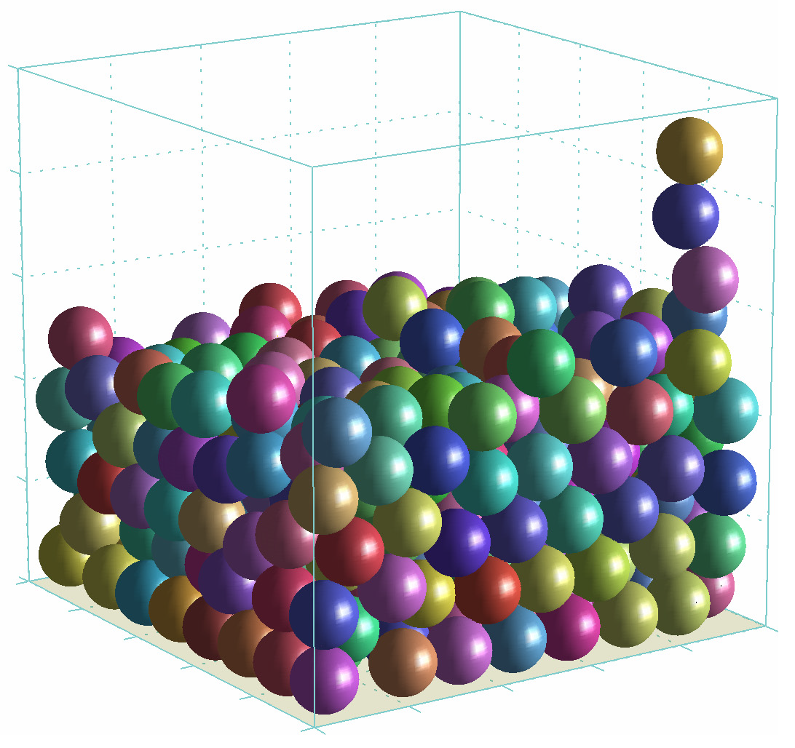

# Pile of particles

The purpose of this project was to simulate a number of spherical particles bouncing on top of each other and to study the basics of modeling and simulation of collisions. Two contact models were implemented and tested: the impulse method (instantaneous transfer of momenta) and the penalty method (linear springs). The preservation of the total energy, the total momentum and the stability of the method were analyzed for the both models.

